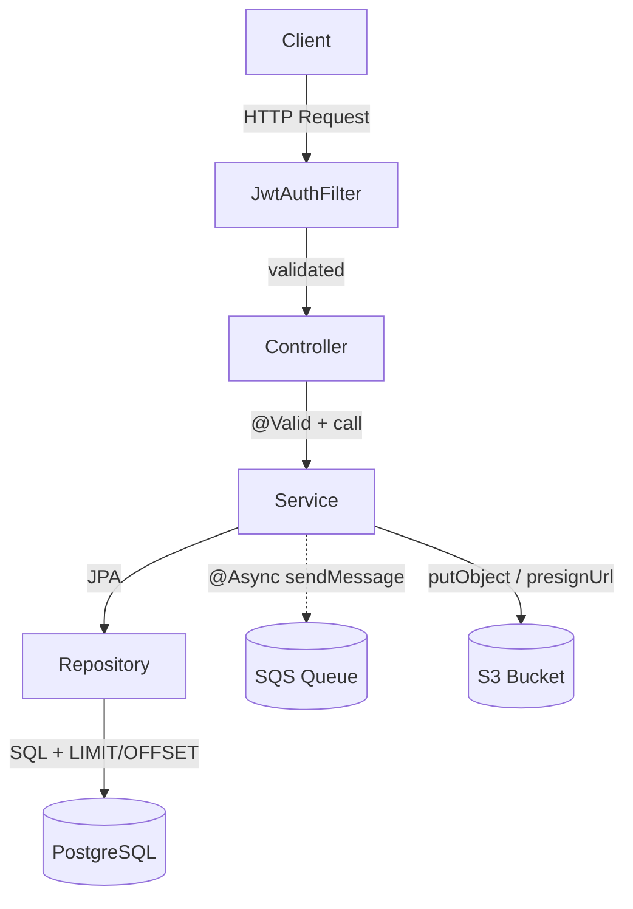
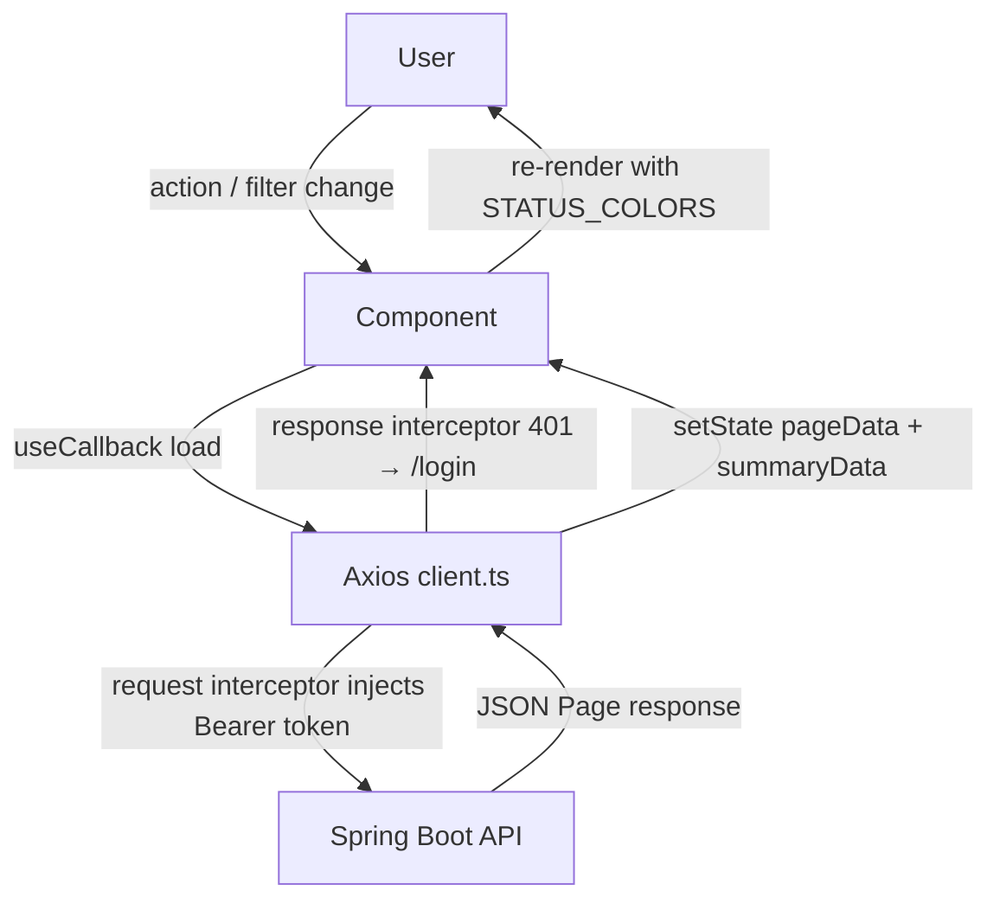
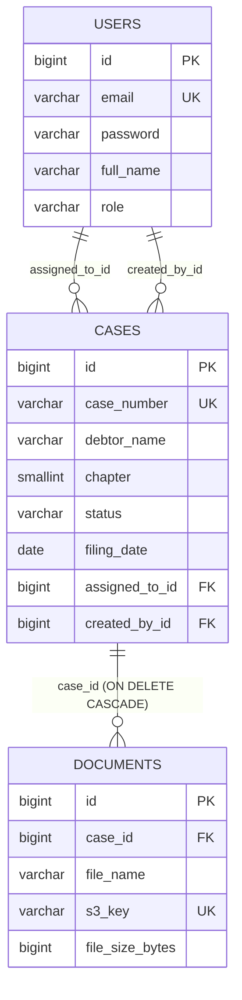
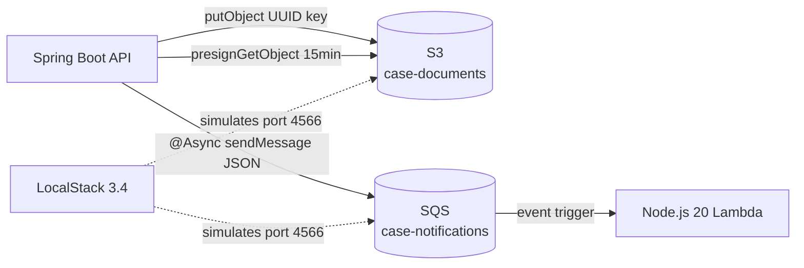
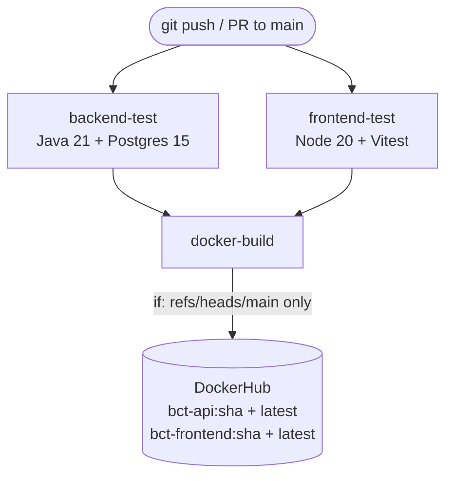
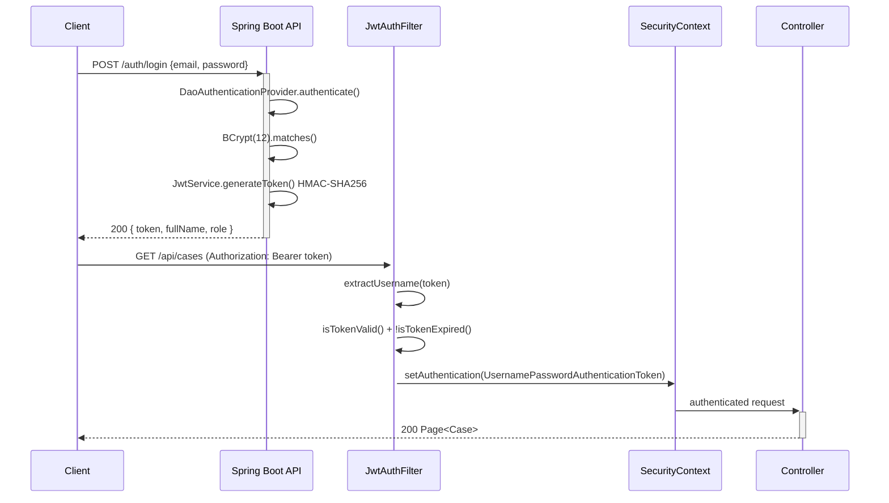

# Interview Talking Points — Bankruptcy Case Tracker
**Generated:** 2026-05-27  
**Target JD:** Stretto — Full Stack Software Engineer  
**Source of truth:** `docs/jd-practice-plan.md` + workspace inspection

---

## 1. Project Summary

> **30-second version — say this out loud:**

"I built a full-stack bankruptcy case management application — directly inspired by Stretto's core domain. It's a web app where legal professionals can log in, search and filter bankruptcy cases, upload case documents to S3, and trigger async status-change notifications via SQS. The backend is Spring Boot 3 with Java 21, the frontend is React with TypeScript, and everything runs locally in Docker with LocalStack simulating AWS. I also wired up a GitHub Actions CI/CD pipeline and wrote unit and component tests. The goal was to cover every required skill on the Stretto JD in one runnable project."

---

## 2. Actual Tech Stack Found

| Area | Technology Found | Evidence From Workspace | Interview Explanation |
|---|---|---|---|
| Backend Language | Java 21 | `pom.xml` `<java.version>21</java.version>` | "Java 21 — latest LTS. I explicitly configured it in Maven to match JD requirement." |
| Backend Framework | Spring Boot 3.5.14 | `pom.xml` `spring-boot-starter-parent 3.5.14` | "Spring Boot 3 on Jakarta EE 10. Covers the JD's Spring Boot + Hibernate + Spring JPA requirements." |
| ORM | Hibernate 6 / Spring Data JPA | `pom.xml` `spring-boot-starter-data-jpa`; `@Entity` models | "Spring Data JPA with Hibernate 6 as the ORM. I used both repository methods and custom JPQL for complex queries." |
| Auth | Spring Security 6 + JJWT 0.12.5 | `pom.xml`; `SecurityConfig.java`; `JwtService.java` | "Stateless JWT auth — filter validates token on every request. BCrypt(12) for password hashing." |
| Database | PostgreSQL 15 | `docker-compose.yml`; `application.yml` datasource | "PostgreSQL 15 in Docker. Flyway manages schema migrations — 3 versioned migration scripts." |
| Schema Migrations | Flyway | `pom.xml` `flyway-core`; `db/migration/V1–V3` SQL files | "Three Flyway scripts: V1 creates schema, V2 seeds demo data, V3 fixes BCrypt hashes." |
| Frontend Framework | React 18.3.1 | `frontend/package.json` | "React 18 with functional components, hooks, and React Router v6 for SPA navigation." |
| Frontend Language | TypeScript 5.4.5 | `frontend/tsconfig.json`; `.tsx` source files | "Full TypeScript on the frontend — strict types for API responses, component props, and route params." |
| Frontend Build | Vite | `frontend/package.json` `vite 5.x` | "Vite for fast dev server and optimised production bundle." |
| Styling | Tailwind CSS 3.4.4 | `frontend/package.json`; `tailwind.config.js` | "Tailwind utility classes — responsive layout without custom CSS overhead." |
| HTTP Client | Axios 1.7.2 | `frontend/package.json`; `frontend/src/api/` | "Axios client with a base URL and JWT Authorization header injected via an interceptor." |
| AWS — S3 | AWS SDK v2 2.25.27 | `pom.xml`; `DocumentService.java` `s3Client.putObject` | "S3 for document storage. I also generate pre-signed GET URLs so the browser downloads directly from S3." |
| AWS — SQS | AWS SDK v2 | `pom.xml`; `NotificationService.java` `sqsClient.sendMessage` | "SQS for async event publishing on case status change — decouples the API from notification delivery." |
| AWS — Lambda | Node.js 20 | `lambda/handler.js` | "Node.js Lambda that consumes SQS messages — logs the notification, simulates SES email or webhook." |
| AWS Simulation | LocalStack 3.4 | `docker-compose.yml` `localstack/localstack:3.4` | "LocalStack runs S3 and SQS locally in Docker so I can develop offline without real AWS credentials." |
| Backend Tests | JUnit 5 + Mockito | `CaseServiceTest.java`; `CaseControllerTest.java` | "Unit tests with Mockito mocks for service layer; @WebMvcTest integration tests for controllers." |
| Frontend Tests | Vitest 1.6 + React Testing Library | `frontend/package.json`; `CasesPage.test.tsx` | "Vitest + RTL — I mock the Axios API module and assert that the UI renders the correct data." |
| CI/CD | GitHub Actions | `.github/workflows/ci.yml` | "Three jobs: backend-test (with a Postgres service container), frontend-test, docker-build on main." |
| Containers | Docker multi-stage + docker-compose | `backend/Dockerfile`; `frontend/Dockerfile`; `docker-compose.yml` | "Multi-stage Docker builds — Maven build stage produces a minimal JRE runtime image. Frontend: Node build → nginx." |
| AI Tooling | GitHub Copilot | Used throughout development | "GitHub Copilot — listed as a preferred tool in the JD. I used it for boilerplate, test scaffolding, and SQL query refinement." |

---

## 3. Main Features Implemented

| Feature | Files / Modules Involved | Skill Demonstrated | How To Explain It |
|---|---|---|---|
| JWT Authentication | `AuthController.java`, `JwtService.java`, `JwtAuthFilter.java`, `SecurityConfig.java` | Spring Security 6, stateless auth | "POST `/api/auth/login` validates credentials, returns a signed JWT. Every subsequent request passes the token in the Authorization header — the filter validates it before the request reaches any controller." |
| User Roles | `User.java` (Role enum: ADMIN/ATTORNEY/TRUSTEE), `SecurityConfig.java` | RBAC, Spring Security | "Three roles stored in the users table. Spring Security injects the principal on each request — controllers can use `@AuthenticationPrincipal` to get the current user." |
| Case CRUD | `CaseController.java`, `CaseService.java`, `CaseRepository.java`, `Case.java` | REST API, Spring Data JPA | "Full CRUD — GET list with filters, GET by ID, POST create, PUT update, PATCH status. Each operation goes through a service layer for business logic before hitting the repository." |
| Paginated Case Search | `CaseRepository.java` JPQL `searchCases()`, `CaseController.java` `Pageable` | Complex SQL, pagination | "I wrote a custom JPQL query with five optional filters (status, chapter, debtor name, date range). Spring's Pageable injects page/size/sort. The result is a Page<Case> with totalElements metadata." |
| Dashboard Summary | `CaseController.java` `GET /summary`, `CaseRepository.java` `countByStatus()` | SQL aggregation | "A single endpoint that returns a status→count map. On the frontend this drives the four summary cards at the top of the cases page." |
| Document Upload to S3 | `DocumentController.java`, `DocumentService.java`, `Document.java` | AWS S3, multipart upload | "The API receives a multipart file, generates a UUID-based S3 key, uploads the bytes via AWS SDK PutObject, then stores the metadata (filename, s3Key, size, contentType) in the documents table." |
| Pre-signed S3 Download | `DocumentService.java` `S3Presigner.presignGetObject()` | AWS S3 presigned URLs | "Instead of proxying the file through the API, I generate a pre-signed URL valid for 15 minutes. The frontend redirects the user directly to S3 — keeps the API stateless and offloads bandwidth." |
| Async SQS Notification | `NotificationService.java` `@Async sendCaseStatusChangeNotification()`, `CaseService.java` | AWS SQS, event-driven | "When `PATCH /cases/{id}/status` is called, the service publishes a JSON event to the SQS queue asynchronously (non-blocking). The Lambda consumer picks it up and processes the notification." |
| Lambda SQS Consumer | `lambda/handler.js` | Node.js, AWS Lambda, SQS | "An event-driven Lambda handler that iterates over the SQS batch, parses the event payload, and processes CASE_STATUS_CHANGED events. It handles partial batch failures gracefully." |
| Schema + Seed Data | `V1__initial_schema.sql`, `V2__seed_data.sql`, `V3__fix_demo_passwords.sql` | Flyway, SQL, DB management | "Flyway runs on startup and applies any pending migrations in version order. V1 creates three tables with indexes, V2 seeds three users and five cases, V3 corrects the BCrypt hashes." |
| Frontend Case List + Filters | `CasesPage.tsx`, `frontend/src/api/` | React, TypeScript, state management | "A React page that fires two parallel API calls — case search and status summary — on mount and on filter change. Filter state is managed with useState + useCallback to debounce re-fetches." |
| Case Detail + Status Change | `CaseDetailPage.tsx` | React, Axios, event-driven UI | "The case detail page shows all fields plus the document list. Changing the status dropdown calls PATCH `/status` which triggers the backend SQS notification in the background." |
| GitHub Actions Pipeline | `.github/workflows/ci.yml` | CI/CD, Docker, GitHub Actions | "Three-job pipeline: backend-test spins up a real Postgres service container and runs `mvn verify`; frontend-test runs `npm ci && npm run test`; docker-build runs on main to validate the Docker images." |
| Docker Compose Stack | `docker-compose.yml`, `backend/Dockerfile`, `frontend/Dockerfile` | Containerisation, local dev | "Four services in docker-compose: postgres, localstack, api, frontend. Health checks ensure postgres is ready before the API starts, and localstack is healthy before the API tries AWS calls." |

---

## 4. JD Skill Mapping

*(JD sourced from `docs/jd-practice-plan.md` — Stretto Full Stack Software Engineer)*

---

### Java + Spring Boot

#### JD Skill
Java + Spring Boot

#### What I Built
Spring Boot 3.2 REST API — auth, cases, documents modules

#### Example Code
```java
@PatchMapping("/{id}/status")
public Case updateStatus(
        @PathVariable Long id,
        @RequestParam CaseStatus status) {
    return caseService.updateStatus(id, status);
}
```

#### How To Explain It
"I followed the standard Spring Boot layered architecture. Controllers handle HTTP concerns only — all business logic lives in the Service layer."

---

### Hibernate + Spring JPA

#### JD Skill
Hibernate + Spring JPA

#### What I Built
`Case`, `User`, `Document` entities; `CaseRepository` with custom JPQL

#### Example Code
```java
@Query("""
    SELECT c FROM Case c
    LEFT JOIN FETCH c.assignedTo
    WHERE (:status IS NULL OR c.status = :status)
      AND (:debtorName IS NULL OR LOWER(c.debtorName)
           LIKE LOWER(CONCAT('%',
                CAST(:debtorName AS String), '%')))
    ORDER BY c.filingDate DESC
    """)
Page<Case> searchCases(
    @Param("status") Case.CaseStatus status,
    @Param("debtorName") String debtorName,
    Pageable pageable);
```

#### How To Explain It
"Each filter short-circuits when `null` so one JPQL query handles every combination. `LEFT JOIN FETCH` on `assignedTo` loads the related user in the same SQL — no N+1."

---

### Node.js

#### JD Skill
Node.js

#### What I Built
`lambda/handler.js` SQS consumer

#### Example Code
```javascript
exports.handler = async (event) => {
  for (const record of event.Records) {
    const payload = JSON.parse(record.body);
    if (payload.eventType === "CASE_STATUS_CHANGED") {
      await handleCaseStatusChanged(payload);
    }
  }
  return { batchItemFailures: [] };
};
```

#### How To Explain It
"The Lambda iterates SQS records individually. Returning `batchItemFailures: []` signals all messages succeeded — one bad message doesn't poison the rest of the batch."

---

### TypeScript + ReactJS

#### JD Skill
TypeScript + ReactJS

#### What I Built
React 18 SPA with TypeScript interfaces, React Router v6

#### Example Code
```typescript
const load = useCallback(async () => {
  setLoading(true)
  try {
    const [pageData, summaryData] = await Promise.all([
      casesApi.search({ ...filters, page: currentPage }),
      casesApi.summary(),
    ])
    setPage(pageData)
    setSummary(summaryData)
  } finally { setLoading(false) }
}, [filters, currentPage])
```

#### How To Explain It
"`useCallback` memoises the load function; `Promise.all` fetches the case list and summary cards in parallel — two API calls in one render cycle."

---

### CSS / HTML

#### JD Skill
CSS / HTML

#### What I Built
Tailwind CSS 3.4, semantic HTML5 in JSX

#### Example Code
```typescript
const STATUS_COLORS: Record<CaseStatus, string> = {
  OPEN:      'bg-green-100 text-green-800',
  CLOSED:    'bg-gray-100  text-gray-700',
  DISMISSED: 'bg-red-100   text-red-700',
  CONVERTED: 'bg-yellow-100 text-yellow-800',
}
```

#### How To Explain It
"Tailwind utility classes for a responsive layout. Status badge colours are driven by a TypeScript `Record` — zero custom CSS."

---

### AWS S3

#### JD Skill
AWS S3

#### What I Built
`DocumentService.java` — PutObject + presigned GetObject

#### Example Code
```java
s3Client.putObject(
    PutObjectRequest.builder()
        .bucket(bucket).key(s3Key)
        .contentType(file.getContentType()).build(),
    RequestBody.fromBytes(file.getBytes()));

// Generate a 15-minute pre-signed download URL
s3Presigner.presignGetObject(
    GetObjectPresignRequest.builder()
        .signatureDuration(Duration.ofMinutes(15))
        .getObjectRequest(r ->
            r.bucket(bucket).key(doc.getS3Key()))
        .build());
```

#### How To Explain It
"The backend uploads to S3 and returns a pre-signed URL. The browser downloads directly from S3 — the API never proxies file bytes, keeping memory usage flat."

---

### AWS SQS

#### JD Skill
AWS SQS

#### What I Built
`NotificationService.java` — `@Async` SendMessage on status change

#### Example Code
```java
@Async
public void sendCaseStatusChangeNotification(
        Long caseId, String caseNumber,
        String oldStatus, String newStatus) {
    Map<String, Object> payload = Map.of(
        "eventType", "CASE_STATUS_CHANGED",
        "caseId",    caseId,
        "oldStatus", oldStatus,
        "newStatus", newStatus,
        "timestamp", Instant.now().toString());
    sqsClient.sendMessage(SendMessageRequest.builder()
        .queueUrl(queueUrl)
        .messageBody(objectMapper.writeValueAsString(payload))
        .build());
}
```

#### How To Explain It
"`@Async` lets the status update return to the caller instantly while the SQS send runs on a background thread. If SQS is unavailable, the case update still succeeds."

---

### AWS Lambda

#### JD Skill
AWS Lambda

#### What I Built
`lambda/handler.js` — SQS-triggered Node.js 20 handler

#### Example Code
*(see Node.js section above — same handler file)*

#### How To Explain It
"A serverless consumer — Node.js 20 is a lightweight fit for an event-driven function. In production this would call SES for email or SNS for push; here it's simulated with LocalStack."

---

### Complex SQL Queries

#### JD Skill
Complex SQL queries

#### What I Built
Flyway migration V1 with 5 targeted indexes; JPQL `searchCases()` with 5 optional filters + pagination; `countByStatus()` GROUP BY aggregation

#### Example Code
```sql
CREATE INDEX idx_cases_status
    ON cases(status);
CREATE INDEX idx_cases_filing_date
    ON cases(filing_date);
CREATE INDEX idx_cases_assigned
    ON cases(assigned_to_id);
CREATE INDEX idx_documents_case
    ON documents(case_id);
```

#### How To Explain It
"I added explicit indexes for the four most common query predicates. Without them, status and date-range searches would be full-table scans as case volume grows."

---

### CI/CD Pipelines

#### JD Skill
CI/CD pipelines

#### What I Built
GitHub Actions — `backend-test` → `frontend-test` → `docker-build`

#### Example Code
```yaml
jobs:
  backend-test:
    services:
      postgres:
        image: postgres:15-alpine
  frontend-test:
    steps:
      - run: npm ci
      - run: npm run test
  docker-build:
    needs: [backend-test, frontend-test]
    if: github.ref == 'refs/heads/main'
```

#### How To Explain It
"Backend and frontend test jobs run in parallel. Docker build only triggers when both pass AND the branch is main — no broken images reach the registry."

---

### Security

#### JD Skill
Security vulnerability remediation

#### What I Built
BCrypt(12), JWT 15-min expiry, CORS whitelist, `@Valid` Bean Validation

#### Example Code
```java
return http
  .csrf(AbstractHttpConfigurer::disable)
  .cors(cors -> cors.configurationSource(
      corsConfigurationSource()))
  .sessionManagement(s ->
      s.sessionCreationPolicy(STATELESS))
  .authorizeHttpRequests(auth -> auth
      .requestMatchers(POST,
          "/auth/login", "/auth/register").permitAll()
      .anyRequest().authenticated())
  .addFilterBefore(jwtAuthFilter,
      UsernamePasswordAuthenticationFilter.class)
  .build();
```

#### How To Explain It
"Stateless session, CSRF disabled (JWT makes it irrelevant), CORS locked to known origins, and a custom JWT filter that runs before Spring's default auth filter."

---

### Agile / Scrum

#### JD Skill
Agile / Scrum

#### What I Built
Phased build plan in `jd-practice-plan.md`, feature-branch + PR workflow

#### Example Code
*(process discipline — no code snippet)*

#### How To Explain It
"I structured the project as eight phased sprints in the practice plan — each phase with a clear deliverable, mirroring how I'd work in a Scrum team."

---

### AI Tools (GitHub Copilot)

#### JD Skill
AI Tools — GitHub Copilot

#### What I Built
Used throughout for boilerplate, test scaffolding, SQL queries

#### Example Code
*(tooling — no code snippet)*

#### How To Explain It
"I used GitHub Copilot to accelerate boilerplate and test scaffolding — listed as a preferred skill in the JD. I reviewed all generated code carefully; it's a fast first draft, not a final answer."

---

## 5. Backend Talking Points



### API Design

**How It Works:**
"I followed a standard layered architecture: Controller → Service → Repository. The context path is `/api`, so all endpoints are under `/api/cases`, `/api/auth`, etc. Every controller method does nothing except call the service — no business logic leaks into controllers. Pagination uses Spring's `Pageable` — the client passes `?page=0&size=10&sort=filingDate,desc` and gets back a `Page<Case>` with `totalElements` and `totalPages` included."

**Example Code:**
```java
@GetMapping
public Page<Case> search(
        @RequestParam(required = false) CaseStatus status,
        @RequestParam(required = false) Short chapter,
        @RequestParam(required = false) String debtorName,
        @RequestParam(required = false)
        @DateTimeFormat(iso = DateTimeFormat.ISO.DATE) LocalDate fromDate,
        @RequestParam(required = false)
        @DateTimeFormat(iso = DateTimeFormat.ISO.DATE) LocalDate toDate,
        @PageableDefault(size = 20, sort = "filingDate") Pageable pageable) {
    return caseService.search(status, chapter, debtorName, fromDate, toDate, pageable);
}
```

**How To Explain It:**
"Every `@RequestParam` is `required = false` — the client can combine any subset of filters. `@PageableDefault` sets safe defaults so the caller doesn't have to specify page/size on every request. Paging is interview-ready because it shows I understand pagination without rolling my own."

---

### Business Logic

**How It Works:**
"The most interesting business rule is the status change flow: when a user calls `PATCH /cases/{id}/status`, the service updates the record and then calls `NotificationService.sendCaseStatusChangeNotification()`. That method is `@Async` — it fires and forgets to SQS without blocking the HTTP response."

**Example Code:**
```java
@Transactional
public Case updateStatus(Long id, CaseStatus newStatus) {
    Case c = getById(id);
    String oldStatus = c.getStatus().name();
    c.setStatus(newStatus);
    Case saved = caseRepository.save(c);
    notificationService.sendCaseStatusChangeNotification(
            saved.getId(), saved.getCaseNumber(),
            oldStatus, newStatus.name());
    return saved;
}
```

**How To Explain It:**
"`@Transactional` ensures the DB write succeeds or rolls back atomically. The `@Async` SQS call happens after the commit — if SQS is down, the status change still persists. The caller gets the updated case immediately."

---

### Validation

**How It Works:**
"I use Spring's `@Valid` on every `@RequestBody`. The `CaseRequest` is a Java record with constraint annotations. If validation fails, Spring throws `MethodArgumentNotValidException` and my `GlobalExceptionHandler` returns a structured 400 with field-level messages."

**Example Code:**
```java
public record CaseRequest(
        @NotBlank String caseNumber,
        @NotBlank String debtorName,
        @NotNull @Min(7) @Max(13) Short chapter,
        @NotNull LocalDate filingDate,
        String courtDistrict, String judgeName,
        String trusteeName, String notes, Long assignedToId
) {}
```

**How To Explain It:**
"Bean Validation runs before the controller body executes — invalid input never reaches the service layer. `@Min(7) @Max(13)` ensures only valid bankruptcy chapters (7, 11, 13) are accepted."

---

### Database Access

**How It Works:**
"For simple lookups I rely on Spring Data derived queries — `findById`, `findByEmail`. For the case search I wrote a JPQL query with five optional filters using `(:param IS NULL OR condition)` so unset filters are effectively skipped."

**Example Code:**
```java
@Query("""
        SELECT c FROM Case c
        LEFT JOIN FETCH c.assignedTo
        WHERE (:status IS NULL OR c.status = :status)
          AND (:chapter IS NULL OR c.chapter = :chapter)
          AND (:debtorName IS NULL OR LOWER(c.debtorName)
               LIKE LOWER(CONCAT('%',
                    CAST(:debtorName AS String), '%')))
          AND (:fromDate IS NULL OR c.filingDate >= :fromDate)
          AND (:toDate   IS NULL OR c.filingDate <= :toDate)
        ORDER BY c.filingDate DESC
        """)
Page<Case> searchCases(
        @Param("status") Case.CaseStatus status,
        @Param("chapter") Short chapter,
        @Param("debtorName") String debtorName,
        @Param("fromDate") LocalDate fromDate,
        @Param("toDate") LocalDate toDate,
        Pageable pageable);
```

**How To Explain It:**
"`LEFT JOIN FETCH c.assignedTo` prevents N+1 queries on the list page. I hit a real Hibernate 6 + PostgreSQL bug — null parameters were sent as `bytea`, breaking `LOWER()`. The fix was `CAST(:debtorName AS String)` in JPQL."

---

### Error Handling

**How It Works:**
"I have a `@RestControllerAdvice` global handler that maps exceptions to HTTP status codes. The 500 handler logs the full stack trace so silent errors don't happen."

**Example Code:**
```java
@RestControllerAdvice
public class GlobalExceptionHandler {
    @ExceptionHandler(EntityNotFoundException.class)
    public ProblemDetail handleNotFound(EntityNotFoundException ex) {
        return ProblemDetail.forStatusAndDetail(HttpStatus.NOT_FOUND, ex.getMessage());
    }
    @ExceptionHandler(MethodArgumentNotValidException.class)
    public ProblemDetail handleValidation(MethodArgumentNotValidException ex) {
        String detail = ex.getBindingResult().getFieldErrors().stream()
                .map(e -> e.getField() + ": " + e.getDefaultMessage())
                .collect(Collectors.joining(", "));
        return ProblemDetail.forStatusAndDetail(HttpStatus.BAD_REQUEST, detail);
    }
    @ExceptionHandler(BadCredentialsException.class)
    public ProblemDetail handleBadCredentials(BadCredentialsException ex) {
        return ProblemDetail.forStatusAndDetail(HttpStatus.UNAUTHORIZED,
                "Invalid email or password");
    }
    @ExceptionHandler(Exception.class)
    public ProblemDetail handleGeneric(Exception ex) {
        log.error("Unhandled exception", ex);
        return ProblemDetail.forStatusAndDetail(HttpStatus.INTERNAL_SERVER_ERROR,
                "An unexpected error occurred");
    }
}
```

**How To Explain It:**
"`ProblemDetail` is the RFC 7807 standard response format — Spring Boot 3 supports it natively. `EntityNotFoundException` → 404, `MethodArgumentNotValidException` → 400, `BadCredentialsException` → 401. The generic 500 handler ensures no raw stack traces leak to the client."

---

### Performance Considerations

**How It Works:**
"I added five database indexes in the V1 Flyway migration covering the most common WHERE and JOIN columns."

**Example Code:**
```sql
CREATE INDEX idx_cases_status      ON cases(status);
CREATE INDEX idx_cases_chapter     ON cases(chapter);
CREATE INDEX idx_cases_filing_date ON cases(filing_date);
CREATE INDEX idx_cases_assigned    ON cases(assigned_to_id);
CREATE INDEX idx_documents_case    ON documents(case_id);
```

**How To Explain It:**
"Without `idx_documents_case`, loading documents for a case would do a full table scan as the documents table grows. The status and filing_date indexes support the most common filter combinations. In production I'd run `EXPLAIN ANALYZE` to verify the query plan."

---

### Trade-offs Made for Simplicity

**How It Works:**
"Several architectural simplifications were made deliberately for this demo scope."

**Example Code:**
*(design decisions — no single code snippet)*

**How To Explain It:**
- "JWT tokens are stateless — there's no token blacklist, so logout just means deleting the token on the client. In production I'd add a Redis-backed token revocation store or use refresh + short-lived access tokens."
- "Lazy loading is enabled (default JPA behaviour). I added `@JsonIgnore` on the `documents` field and `@JsonIgnoreProperties` on lazy-loaded User proxies to prevent `ByteBuddyInterceptor` serialization errors."
- "The API uses Tomcat's default thread pool. For heavy upload traffic I'd consider switching to virtual threads (Java 21) or a reactive stack."

---

## 6. Frontend Talking Points



### UI Structure

**How It Works:**
"The app has four pages: Login, Cases List, Case Detail, and a Register page. React Router v6's `<Routes>` handles navigation with a context-based auth guard. The `CasesPage` fires two API calls in parallel using `Promise.all` — status summary cards at the top and the filterable, paginated table below."

**Example Code:**
```typescript
const load = useCallback(async () => {
  setLoading(true)
  try {
    const [pageData, summaryData] = await Promise.all([
      casesApi.search({
        debtorName: filters.debtorName || undefined,
        status: filters.status || undefined,
        chapter: filters.chapter || undefined,
        page: currentPage,
        size: 10,
      }),
      casesApi.summary(),
    ])
    setPage(pageData)
    setSummary(summaryData)
  } finally { setLoading(false) }
}, [filters, currentPage])
```

**How To Explain It:**
"`Promise.all` fires both API calls concurrently — the page renders in one round-trip instead of two sequential requests. `useCallback` memoises the load function so it doesn't re-create on every render, preventing infinite effect loops."

---

### State Management

**How It Works:**
"I kept state management simple — `useState` and `useCallback` in each page component, no Redux or Zustand. Auth state lives in `AuthContext` so any component can read the current user and token without prop drilling."

**Example Code:**
```typescript
const login = useCallback(async (email: string, password: string) => {
  const data = await authApi.login(email, password)
  localStorage.setItem('token', data.token)
  localStorage.setItem('fullName', data.fullName)
  localStorage.setItem('role', data.role)
  setAuth({ token: data.token, fullName: data.fullName, role: data.role })
}, [])
// isAuthenticated: !!auth.token
```

**How To Explain It:**
"`AuthContext` is exported so any component can consume it — and it's easy to mock in Storybook or tests. If the app scaled to dozens of pages I'd introduce React Query — it gives caching, background refetch, and loading/error states out of the box."

---

### API Integration

**How It Works:**
"I centralised all API calls in `frontend/src/api/`. The Axios instance has two interceptors: a request interceptor that injects the JWT header, and a response interceptor that handles 401s by clearing storage and redirecting to `/login`."

**Example Code:**
```typescript
const api = axios.create({
  baseURL: '/api',
  headers: { 'Content-Type': 'application/json' },
})
api.interceptors.request.use((config) => {
  const token = localStorage.getItem('token')
  if (token) { config.headers.Authorization = `Bearer ${token}` }
  return config
})
api.interceptors.response.use(
  (res) => res,
  (err) => {
    if (err.response?.status === 401) {
      localStorage.removeItem('token')
      window.location.href = '/login'
    }
    return Promise.reject(err)
  }
)
```

**How To Explain It:**
"The interceptors act as middleware — no page component ever touches auth headers or handles 401s manually. If the token expires mid-session, the user is automatically redirected to login on the next API call."

---

### User Experience

**How It Works:**
"Status badges use a TypeScript `Record` mapping each status to a Tailwind CSS class pair. Filtering is reactive — changing any filter or page triggers a new API call."

**Example Code:**
```typescript
const STATUS_COLORS: Record<CaseStatus, string> = {
  OPEN:      'bg-green-100 text-green-800',
  CLOSED:    'bg-gray-100  text-gray-700',
  DISMISSED: 'bg-red-100   text-red-700',
  CONVERTED: 'bg-yellow-100 text-yellow-800',
}
```

**How To Explain It:**
"TypeScript's `Record<CaseStatus, string>` makes the map exhaustive — if a new status is added to the enum, the compiler will flag a missing color mapping before it ever reaches production."

---

### Trade-offs Made for Simplicity

**How It Works:**
"Several frontend simplifications were deliberate for demo scope."

**Example Code:**
*(design decisions — no single code snippet)*

**How To Explain It:**
- "No React Query or SWR — I manage loading/error state manually with `useState`. Simple enough for this size, but I'd adopt React Query in production."
- "JWT stored in `localStorage` — convenient but vulnerable to XSS. In production I'd store the token in an httpOnly cookie."
- "No optimistic UI updates — status changes re-fetch the full page after success. A real app would update local state immediately and roll back on error."

---

## 7. Database Talking Points



### Schema Design

**How It Works:**
"Three tables: `users`, `cases`, `documents`. `cases` has two foreign keys to `users` — `assigned_to_id` (the attorney handling the case) and `created_by_id` (audit trail). `documents` has a foreign key to `cases` with `ON DELETE CASCADE`."

**Example Code:**
```sql
CREATE TABLE cases (
  id            BIGSERIAL PRIMARY KEY,
  case_number   VARCHAR(100) NOT NULL UNIQUE,
  debtor_name   VARCHAR(255) NOT NULL,
  chapter       SMALLINT NOT NULL,
  status        VARCHAR(50)  NOT NULL DEFAULT 'OPEN',
  filing_date   DATE NOT NULL,
  assigned_to_id BIGINT REFERENCES users(id),
  created_by_id  BIGINT REFERENCES users(id),
  created_at    TIMESTAMP NOT NULL DEFAULT NOW(),
  updated_at    TIMESTAMP NOT NULL DEFAULT NOW()
);
CREATE TABLE documents (
  id              BIGSERIAL PRIMARY KEY,
  case_id         BIGINT NOT NULL REFERENCES cases(id) ON DELETE CASCADE,
  file_name       VARCHAR(255) NOT NULL,
  s3_key          VARCHAR(500) NOT NULL UNIQUE,
  content_type    VARCHAR(100),
  file_size_bytes BIGINT,
  uploaded_by_id  BIGINT REFERENCES users(id),
  uploaded_at     TIMESTAMP NOT NULL DEFAULT NOW()
);
```

**How To Explain It:**
"The dual FK on `cases` (`assigned_to_id` vs `created_by_id`) models two distinct relationships — who owns the case vs who originally created it. `ON DELETE CASCADE` on documents means the application never needs a manual cleanup step when a case is removed."

---

### Relationships

**How It Works:**
"One case has many documents; one user can be assigned to many cases. In JPA these are `@ManyToOne` on the owning side and `@OneToMany(fetch = LAZY)` on the parent. All collections are lazy to avoid N+1 on list endpoints."

**Example Code:**
```java
// On Document entity
@ManyToOne(fetch = FetchType.LAZY)
@JoinColumn(name = "case_id")
private Case case;

// On Case entity
@OneToMany(mappedBy = "case", fetch = FetchType.LAZY)
@JsonIgnore
private List<Document> documents;

@ManyToOne(fetch = FetchType.LAZY)
@JoinColumn(name = "assigned_to_id")
@JsonIgnoreProperties({"hibernateLazyInitializer", "handler"})
private User assignedTo;
```

**How To Explain It:**
"`@JsonIgnore` on `documents` prevents the full document list serialising on every case response. `@JsonIgnoreProperties` on lazy-loaded proxies avoids `ByteBuddyInterceptor` serialization errors that Hibernate 6 throws when you try to serialize an uninitialized proxy."

---

### Queries

**How It Works:**
"The interesting query is `searchCases()` — five optional filters in one JPQL statement. Each condition is `(:param IS NULL OR condition)` so unset filters are always true and effectively skipped."

**Example Code:**
```java
@Query("""
        SELECT c FROM Case c
        LEFT JOIN FETCH c.assignedTo
        WHERE (:status IS NULL OR c.status = :status)
          AND (:chapter IS NULL OR c.chapter = :chapter)
          AND (:debtorName IS NULL OR LOWER(c.debtorName)
               LIKE LOWER(CONCAT('%',
                    CAST(:debtorName AS String), '%')))
          AND (:fromDate IS NULL OR c.filingDate >= :fromDate)
          AND (:toDate   IS NULL OR c.filingDate <= :toDate)
        ORDER BY c.filingDate DESC
        """)
Page<Case> searchCases(/* @Param params */, Pageable pageable);

@Query("SELECT c.status AS status, COUNT(c) AS total FROM Case c GROUP BY c.status")
List<StatusCount> countByStatus();
```

**How To Explain It:**
"`countByStatus()` returns a projection interface `StatusCount` — cleaner than `List<Object[]>`. The service converts it to `Map<String, Long>` for the frontend dashboard cards. No N+1, no dynamic query building."

---

### Indexing

**How It Works:**
"Five indexes on the most-queried columns cover every WHERE predicate and FK join in the application."

**Example Code:**
```sql
CREATE INDEX idx_cases_status      ON cases(status);
CREATE INDEX idx_cases_chapter     ON cases(chapter);
CREATE INDEX idx_cases_filing_date ON cases(filing_date);
CREATE INDEX idx_cases_assigned    ON cases(assigned_to_id);
CREATE INDEX idx_documents_case    ON documents(case_id);
```

**How To Explain It:**
"Without `idx_documents_case`, every `SELECT … WHERE case_id = ?` would be a full table scan. `idx_cases_filing_date` supports date-range filters with a range scan. In production I'd run `EXPLAIN ANALYZE` on the search query to verify index usage."

---

### Trade-offs

**How It Works:**
"Some DB design decisions were simplified for the demo."

**Example Code:**
*(design decisions — no code snippet)*

**How To Explain It:**
- "No full-text search — debtor name search uses SQL `LIKE '%name%'` which can't use a B-tree index. For production I'd add a PostgreSQL GIN index with `pg_trgm` or move to Elasticsearch."
- "`updated_at` is managed by Hibernate's `@PreUpdate`. In production I'd add a database trigger as a safety net for any out-of-ORM updates."

---

### What I Would Improve for Production
1. Add `pg_trgm` GIN index on `debtor_name` for fast fuzzy search
2. Add read replicas — all list/search queries go to the replica, writes go to primary
3. Tune HikariCP `maximumPoolSize` based on load testing (it's already Spring Boot's default pool)
4. Partition `cases` by `filing_date` for historical data archival

---

## 8. Cloud Talking Points



### Services Used / Simulated

**How It Works:**
"I use three AWS services: S3 for document storage, SQS for async notifications, and Lambda as the SQS consumer. All three run locally via LocalStack 3.4 in Docker — same API surface as real AWS, so switching is just an environment variable change."

**Example Code:**
```yaml
# application.yml
aws:
  endpoint: ${AWS_ENDPOINT:http://localhost:4566}
  s3:
    bucket: ${S3_BUCKET:case-documents}
  sqs:
    notification-queue-url: ${SQS_QUEUE_URL:http://localhost:4566/000000000000/case-notifications}
```

**How To Explain It:**
"All AWS config comes from environment variables. In Docker Compose `AWS_ENDPOINT` points to `http://localstack:4566`. In production ECS you remove the endpoint override and provide IAM role credentials — zero code changes required."

---

### Why These Services Make Sense

**How It Works:**
"S3 for blobs, SQS for decoupling, Lambda for serverless event processing — each service is the right tool for its workload type."

**Example Code:**
```java
// S3 upload + pre-signed download
String s3Key = "cases/" + caseId + "/" + UUID.randomUUID() + "_" + file.getOriginalFilename();
s3Client.putObject(
        PutObjectRequest.builder().bucket(bucket).key(s3Key)
                .contentType(file.getContentType()).build(),
        RequestBody.fromBytes(file.getBytes()));

PresignedGetObjectRequest presigned = s3Presigner.presignGetObject(
        GetObjectPresignRequest.builder()
                .signatureDuration(Duration.ofMinutes(15))
                .getObjectRequest(r -> r.bucket(bucket).key(doc.getS3Key()))
                .build());
return presigned.url().toString();
```

**How To Explain It:**
"Pre-signed URLs mean the API never proxies file bytes — S3 handles the download directly, keeping API memory usage flat. The 15-minute expiry limits the window for URL leakage."

---

### How This Maps to the JD

**How It Works:**
"The Stretto JD calls out EC2, ECS, Lambda, S3, and SQS specifically. I've covered S3, SQS, and Lambda. EC2/ECS is the deployment target for the containerised API."

**Example Code:**
```javascript
// lambda/handler.js — SQS consumer
exports.handler = async (event) => {
  for (const record of event.Records) {
    const payload = JSON.parse(record.body);
    if (payload.eventType === "CASE_STATUS_CHANGED") {
      await handleCaseStatusChanged(payload);
    }
  }
  return { batchItemFailures: [] };
};
```

**How To Explain It:**
"`batchItemFailures: []` signals all records succeeded. In production the handler would call SES for email or SNS for push notifications. Returning partial failures prevents SQS from re-delivering only the failed records — critical for avoiding duplicate notifications."

---

### What I Would Improve for Production
1. Use IAM roles instead of static `AWS_ACCESS_KEY_ID`/`AWS_SECRET_ACCESS_KEY` — ECS tasks get instance role credentials automatically
2. Enable SQS Dead Letter Queue — messages that fail 3 times go to a DLQ for investigation
3. Set S3 bucket policy to deny public access + enable SSE-S3 encryption at rest
4. Use AWS Secrets Manager for DB credentials instead of environment variables
5. Deploy Lambda to real AWS with a proper SQS event source mapping

---

## 9. CI/CD Talking Points



### Build

**How It Works:**
"The GitHub Actions workflow triggers on push to `main` or `develop`, and on PRs targeting `main`. `backend-test` uses `actions/setup-java@v4` with `distribution: temurin` and runs `mvn verify -q`."

**Example Code:**
```yaml
backend-test:
  runs-on: ubuntu-latest
  services:
    postgres:
      image: postgres:15-alpine
      env:
        POSTGRES_DB: casetracker_test
        POSTGRES_USER: casetracker
        POSTGRES_PASSWORD: casetracker
      options: >-
        --health-cmd pg_isready
        --health-interval 10s
        --health-timeout 5s
        --health-retries 5
  steps:
    - uses: actions/checkout@v4
    - uses: actions/setup-java@v4
      with: { java-version: '21', distribution: temurin, cache: maven }
    - run: mvn verify -q
  env:
    DB_HOST: localhost
    JWT_SECRET: ci-test-secret-key-minimum-32-characters
    AWS_ENDPOINT: http://localhost:4566
```

**How To Explain It:**
"The `services` block spins up a real Postgres 15 container alongside the job. The `--health-cmd pg_isready` option means GitHub Actions waits until Postgres is accepting connections before running tests — no flaky 'connection refused' errors."

---

### Test

**How It Works:**
"Backend tests run against real PostgreSQL — not H2. Frontend tests use `npm ci` for deterministic installs then Vitest in CI mode."

**Example Code:**
```yaml
frontend-test:
  runs-on: ubuntu-latest
  steps:
    - uses: actions/checkout@v4
    - uses: actions/setup-node@v4
      with: { node-version: '20', cache: npm, cache-dependency-path: frontend/package-lock.json }
    - run: npm ci
      working-directory: frontend
    - run: npx tsc --noEmit
      working-directory: frontend
    - run: npm run test
      working-directory: frontend
```

**How To Explain It:**
"`npx tsc --noEmit` runs the TypeScript compiler as a type-check without emitting files — it catches type errors that Vitest wouldn't. `npm ci` (not `npm install`) uses `package-lock.json` for deterministic, reproducible installs."

---

### Docker Image

**How It Works:**
"The `docker-build` job uses multi-stage Dockerfiles. Backend: Maven build → minimal JRE runtime. Frontend: Node build → nginx static file server."

**Example Code:**
```dockerfile
# backend/Dockerfile
FROM maven:3.9.7-eclipse-temurin-21 AS build
WORKDIR /app
COPY pom.xml .
RUN mvn dependency:go-offline -q
COPY src ./src
RUN mvn package -DskipTests -q

FROM eclipse-temurin:21-jre-jammy
RUN addgroup --system appgroup \
 && adduser --system --ingroup appgroup appuser
USER appuser
COPY --from=build /app/target/*.jar app.jar
EXPOSE 8080
ENTRYPOINT ["java", "-jar", "app.jar"]
```

**How To Explain It:**
"The `dependency:go-offline` layer is cached separately from the source copy — rebuilds only re-download dependencies when `pom.xml` changes. The non-root `appuser` follows the principle of least privilege — a compromised container can't write to the host filesystem as root."

---

### Deployment

**How It Works:**
"The `docker-build` job depends on both test jobs and runs only on `main`. It pushes images to DockerHub with both a SHA tag and `latest`."

**Example Code:**
```yaml
docker-build:
  needs: [backend-test, frontend-test]
  if: github.ref == 'refs/heads/main'
  steps:
    - uses: docker/build-push-action@v5
      with:
        context: ./backend
        push: true
        tags: |
          ${{ secrets.DOCKERHUB_USERNAME }}/bct-api:${{ github.sha }}
          ${{ secrets.DOCKERHUB_USERNAME }}/bct-api:latest
        cache-from: type=gha
        cache-to: type=gha,mode=max
```

**How To Explain It:**
"SHA tags enable pinned deployments — you always know exactly which commit is running in production. `latest` is for convenience. GitHub Actions cache (`type=gha`) speeds up layer reuse across runs."

---

### Rollback / Safety Checks

**How It Works:**
"The dependency chain is the safety gate: tests must pass before Docker builds, and Docker builds gate deployments."

**Example Code:**
*(pipeline dependency graph — see Mermaid diagram above)*

**How To Explain It:**
"For rollback, ECS supports rolling deployment with task definition revisions — you roll back by re-registering the previous revision. The SHA-tagged image in ECR ensures the exact previous build is always available."

---

### What This Demonstrates for Interview

**How It Works:**
"This pipeline covers the three pillars of CI/CD: automated verification, artefact creation, and deployment automation."

**Example Code:**
*(design rationale — no single code snippet)*

**How To Explain It:**
"The Postgres service container in `backend-test` is a detail most candidates miss — it shows I know the difference between unit tests with mocks and integration tests against a real database. The `if: github.ref == 'refs/heads/main'` guard prevents feature branch pushes from flooding the image registry."

---

## 10. Testing Talking Points

### Unit Tests (`CaseServiceTest.java`)

**How It Works:**
"I tested `CaseService` in isolation using Mockito. I mocked `CaseRepository`, `UserRepository`, and `NotificationService`, then injected them with `@InjectMocks`."

**Example Code:**
```java
@Test
void updateStatus_shouldPublishSqsNotification() {
    Case existingCase = new Case();
    existingCase.setId(1L);
    existingCase.setCaseNumber("CH7-2024-001");
    existingCase.setStatus(CaseStatus.OPEN);
    when(caseRepository.findById(1L)).thenReturn(Optional.of(existingCase));
    when(caseRepository.save(any(Case.class))).thenAnswer(i -> i.getArgument(0));

    caseService.updateStatus(1L, CaseStatus.CLOSED);

    verify(notificationService).sendCaseStatusChangeNotification(
            eq(1L), eq("CH7-2024-001"), eq("OPEN"), eq("CLOSED"));
}
```

**How To Explain It:**
"This test verifies the SQS notification is called with the correct old and new status strings. If someone refactors `updateStatus` and removes the notification call, this test catches it immediately. `@InjectMocks` + `@ExtendWith(MockitoExtension.class)` — no Spring context, runs in milliseconds."

---

### Integration Tests (`CaseControllerTest.java`)

**How It Works:**
"I used `@WebMvcTest` to test the controller layer with a mocked `CaseService`. This validates HTTP routing, request mapping, and response serialization without starting a full context or hitting a database."

**Example Code:**
```java
@WebMvcTest(CaseController.class)
class CaseControllerTest {
    @Autowired MockMvc mockMvc;
    @MockBean CaseService caseService;

    @Test
    @WithMockUser
    void GET_cases_shouldReturnPage() throws Exception {
        when(caseService.search(any(), any(), any(), any(), any(), any()))
                .thenReturn(new PageImpl<>(List.of()));

        mockMvc.perform(get("/cases"))
               .andExpect(status().isOk())
               .andExpect(jsonPath("$.content").isArray());
    }

    @Test
    void GET_cases_unauthenticated_shouldReturn401() throws Exception {
        mockMvc.perform(get("/cases"))
               .andExpect(status().isUnauthorized());
    }
}
```

**How To Explain It:**
"`@WebMvcTest` boots only the web layer — Spring MVC, Jackson, and security filters. `@WithMockUser` injects a mock principal so authenticated tests don't need a real JWT. The unauthenticated test verifies the security config actually rejects anonymous requests."

---

### Frontend Tests (`CasesPage.test.tsx`)

**How It Works:**
"I used Vitest with React Testing Library. The entire `@/api` module is mocked with `vi.mock()` so no real HTTP calls are made."

**Example Code:**
```typescript
vi.mock('@/api', () => ({
  casesApi: {
    search: vi.fn().mockResolvedValue({
      content: [{ id: 1, caseNumber: 'CH7-2024-001',
                  debtorName: 'John Doe', status: 'OPEN', chapter: 7 }],
      totalPages: 1, totalElements: 1,
    }),
    summary: vi.fn().mockResolvedValue({ OPEN: 1 }),
  },
}))

it('renders case list and status summary', async () => {
  render(<MemoryRouter><CasesPage /></MemoryRouter>)
  expect(await screen.findByText('CH7-2024-001')).toBeInTheDocument()
  expect(screen.getByText('John Doe')).toBeInTheDocument()
})
```

**How To Explain It:**
"`vi.mock()` replaces the entire API module at the module boundary — the component code doesn't change at all. `findByText` is async — it waits for React to resolve the mocked promises and re-render. This tests the full component render cycle, not just snapshot matching."

---

### What Risks the Tests Cover
- Service-layer business logic bugs (wrong status on create, missing SQS call)
- Controller routing / HTTP method mismatches
- UI rendering with real async data loading
- TypeScript type contract between API responses and UI components

---

### What Additional Tests I Would Add in Production
1. **Testcontainers**: Spin up a real PostgreSQL container and run the JPQL search query end-to-end — verifies the Hibernate 6 / PostgreSQL type inference fix
2. **Spring Boot `@SpringBootTest`** with full context for auth filter integration testing
3. **MSW (Mock Service Worker)**: Frontend API mocking at the network level — more realistic than mocking the Axios module
4. **Playwright E2E**: Login → create case → upload document → change status → verify SQS message logged
5. **Security tests**: Verify unauthenticated requests to `/cases` return 401, and ROLE-restricted endpoints return 403

---

## 11. Security Talking Points



### Authentication

**How It Works:**
"JWT-based stateless authentication using JJWT 0.12.5 with HMAC-SHA256 signing. The secret key is injected from an environment variable. Tokens expire in 15 minutes. The JWT filter runs on every request as a `OncePerRequestFilter`."

**Example Code:**
```java
// JwtAuthFilter.doFilterInternal
String authHeader = request.getHeader("Authorization");
if (authHeader == null || !authHeader.startsWith("Bearer ")) {
    filterChain.doFilter(request, response); return;
}
String token = authHeader.substring(7);
String username = jwtService.extractUsername(token);
if (username != null
        && SecurityContextHolder.getContext().getAuthentication() == null) {
    userRepository.findByEmail(username).ifPresent(user -> {
        if (jwtService.isTokenValid(token, user)) {
            var auth = new UsernamePasswordAuthenticationToken(
                    user, null, user.getAuthorities());
            auth.setDetails(new WebAuthenticationDetailsSource()
                    .buildDetails(request));
            SecurityContextHolder.getContext().setAuthentication(auth);
        }
    });
}
filterChain.doFilter(request, response);
```

**How To Explain It:**
"The filter only sets the `SecurityContext` if no authentication already exists — prevents double-processing. `OncePerRequestFilter` guarantees it runs exactly once per HTTP request even in servlet forwarding scenarios."

---

### Authorization

**How It Works:**
"Spring Security's `SecurityConfig` defines authorization rules. The three roles (ADMIN, ATTORNEY, TRUSTEE) are stored in the `users` table and loaded by `UserDetailsService`."

**Example Code:**
```java
.authorizeHttpRequests(auth -> auth
    .requestMatchers(HttpMethod.POST,
        "/auth/login", "/auth/register").permitAll()
    .requestMatchers("/actuator/health").permitAll()
    .requestMatchers("/swagger-ui/**", "/v3/api-docs/**").permitAll()
    .anyRequest().authenticated()
)
.addFilterBefore(jwtAuthFilter,
    UsernamePasswordAuthenticationFilter.class)
```

**How To Explain It:**
"Allowlisting is safer than denylisting — I explicitly permit a small set of public endpoints and require authentication for everything else. `addFilterBefore` places the JWT filter ahead of Spring's default username/password filter so the JWT path is evaluated first."

---

### Input Validation

**How It Works:**
"Every `@RequestBody` is annotated with `@Valid`. Invalid input returns a structured 400 response with per-field error messages — no raw stack traces leak to the client."

**Example Code:**
```java
@ExceptionHandler(MethodArgumentNotValidException.class)
public ProblemDetail handleValidation(MethodArgumentNotValidException ex) {
    String detail = ex.getBindingResult().getFieldErrors().stream()
            .map(e -> e.getField() + ": " + e.getDefaultMessage())
            .collect(Collectors.joining(", "));
    return ProblemDetail.forStatusAndDetail(HttpStatus.BAD_REQUEST, detail);
}
```

**How To Explain It:**
"The response tells the client exactly which fields failed and why — enough to fix the request without exposing implementation details. `ProblemDetail` (RFC 7807) is the standard format; Spring Boot 3 supports it natively."

---

### Secrets Management

**How It Works:**
"All secrets are injected via environment variables — never hardcoded. The JWT secret falls back to a placeholder in development but is required in production."

**Example Code:**
```yaml
# application.yml
security:
  jwt:
    secret: ${JWT_SECRET:change-this-secret-key-minimum-32-chars}
    expiration-ms: 900000
aws:
  endpoint: ${AWS_ENDPOINT:http://localhost:4566}
  access-key: ${AWS_ACCESS_KEY_ID:test}
  secret-key: ${AWS_SECRET_ACCESS_KEY:test}
```

**How To Explain It:**
"The `${VAR:default}` syntax provides a safe fallback for local development while requiring real values in production. In production I'd use AWS Secrets Manager — the app fetches the secret at startup via the AWS SDK, so credentials never appear in task definitions or environment variable lists."

---

### CORS / API Security

**How It Works:**
"The `SecurityConfig` configures CORS to allow only known frontend origins. CSRF is disabled because JWT-based stateless auth doesn't use cookies."

**Example Code:**
```java
@Bean
public CorsConfigurationSource corsConfigurationSource() {
    CorsConfiguration config = new CorsConfiguration();
    config.setAllowedOrigins(List.of(
        "http://localhost:5173",   // Vite dev server
        "http://localhost:3000"    // Docker nginx
    ));
    config.setAllowedMethods(List.of(
        "GET", "POST", "PUT", "PATCH", "DELETE", "OPTIONS"));
    config.setAllowedHeaders(List.of("*"));
    config.setAllowCredentials(true);
    // ...
}
```

**How To Explain It:**
"Explicit origin allowlist prevents other domains from making credentialed requests to the API. CSRF is safe to disable here because the browser can't send a JWT from `localStorage` cross-site — CSRF attacks rely on cookies being sent automatically. In production this list would contain only the deployed frontend domain."

---

### Production Improvements
1. Move JWT to httpOnly cookies to prevent XSS token theft
2. Add refresh token rotation — short-lived access tokens, longer-lived refresh tokens stored server-side
3. Add rate limiting on `/auth/login` to prevent brute force (Spring Cloud Gateway or a servlet filter)
4. Enable Spring Security's CSRF protection for cookie-based auth
5. Add `Content-Security-Policy` and `X-Content-Type-Options` response headers
6. Use IAM roles instead of static AWS credentials in production ECS deployment

---

## 12. System Design Explanation

> **Say this out loud as an architecture walkthrough:**

"Let me walk you through the full flow.

**User flow:** A legal professional opens the browser, hits `localhost:3000`. nginx serves the static React bundle. The login form posts to `/api/auth/login` — if credentials are valid, Spring Security and `JwtService` return a signed JWT. The React app stores it in localStorage and injects it into every Axios request from then on.

**Frontend flow:** `CasesPage` loads and fires two parallel requests — `GET /api/cases` for the paginated list and `GET /api/cases/summary` for the dashboard counts. The page renders both when both resolve. Filter changes trigger a new set of requests automatically. The detail page adds a third request — `GET /api/cases/{id}` — and a fourth for the document list.

**Backend flow:** Every request hits the `JwtAuthFilter` first. It extracts the token, validates the signature and expiry, and populates the Spring Security context. The request then routes to the appropriate controller, goes through the service layer where business rules live, and down to Spring Data JPA repositories which generate SQL and execute it against PostgreSQL.

**Database flow:** Flyway has already applied three migration scripts on startup — schema, seed data, and a password fix. The JPQL `searchCases()` query hits indexes on `status`, `chapter`, and `filing_date`. Hibernate translates it to parameterized SQL — no string interpolation, so no SQL injection risk.

**Cloud / async flow:** When a user changes a case status via `PATCH /cases/{id}/status`, the service saves the record to PostgreSQL and then calls `NotificationService.sendCaseStatusChangeNotification()` — which is `@Async` so it runs in a separate thread pool and doesn't block the HTTP response. It publishes a JSON message to the SQS queue. The Node.js Lambda consumer reads the message and processes the notification — currently it logs it, but in production it would call SES to send an email.

**Deployment flow:** GitHub Actions runs on every push to main. Backend tests run against a real Postgres service container. Frontend tests run against mocked APIs with Vitest. If both pass, the Docker images are built. To deploy to production I'd push the images to ECR and update an ECS Fargate service definition — or use Railway for a simpler PaaS deployment.

**Bottlenecks:** The most likely bottleneck under load is the case search query — it's a full table scan on `debtor_name` because SQL `LIKE '%pattern%'` can't use a B-tree index. I'd fix that with a PostgreSQL GIN index using `pg_trgm`, or move to Elasticsearch for full-text search.

**Scalability:** The backend is stateless — JWT means no server-side session, so I can run multiple API replicas behind a load balancer without sticky sessions. S3 and SQS are already horizontally scalable by nature. The main scaling challenge is PostgreSQL — I'd add read replicas for search traffic and use HikariCP tuning to manage connection pool size."

---

## 13. Behavioral Story (STAR Format)

> **Situation:**
"I was preparing for a Full Stack Software Engineer interview at Stretto, a legal-tech company that builds enterprise tools for the bankruptcy ecosystem. The job description listed a long set of technical requirements — Java, Spring Boot, React, TypeScript, AWS S3, SQS, Lambda, CI/CD pipelines, and security — and I wanted to be able to speak concretely to every one of them, not just theoretically."

> **Task:**
"I decided to build a portfolio project from scratch that covered as many JD skills as possible in a single end-to-end application. The goal wasn't a production system — it was a working, runnable demo I could walk an interviewer through and answer detailed questions about."

> **Action:**
"I planned an eight-phase build: backend foundation, database migrations, React frontend, AWS integrations, Docker containerisation, testing, CI/CD, and documentation. I used GitHub Copilot to accelerate boilerplate but wrote all the business logic and made all architectural decisions myself. The most interesting technical problems I solved were: a Hibernate 6 + PostgreSQL `lower(bytea)` type inference bug that required a JPQL `CAST` fix; Hibernate lazy proxy serialization errors that I resolved with `@JsonIgnoreProperties`; and a LocalStack health check incompatibility where version 3.4 reports `running` instead of `available` — I fixed the Docker Compose grep pattern. I wrote unit tests for the service layer, a WebMvcTest for the controller, and a Vitest + RTL component test for the cases page."

> **Result:**
"The project runs end-to-end with `docker compose up --build` — login works, five seeded cases load, documents upload to LocalStack S3, status changes publish to SQS, and the GitHub Actions pipeline passes on every push. More importantly, I now have concrete, specific answers for every technical question the interviewer might ask — from 'how does your JWT filter work' to 'walk me through your CI/CD pipeline' to 'what would you change for production'. The project is pushed to GitHub at github.com/chutieu312/bankruptcy-case-tracker."

---

## 14. Mock Interview Questions

---

**Q1: Walk me through your Spring Boot API architecture.**

> **Strong answer:** "I used a three-layer architecture: Controller, Service, Repository. Controllers handle HTTP routing and input/output mapping only — no business logic. Services contain all business rules, including the SQS notification on status change. Repositories extend `JpaRepository` and add custom JPQL for the complex search query. The context path is `/api` so all routes are namespaced. I also have a `GlobalExceptionHandler` annotated with `@RestControllerAdvice` that maps exceptions to appropriate HTTP status codes — 400 for validation, 404 for not found, 401 for auth failures, 500 for everything else."

> **What they're testing:** Layered architecture knowledge, separation of concerns.

> **Follow-up:** "How would you handle a use case that requires calling two different services — do you do that in the controller or the service?"

---

**Q2: How does your JWT authentication work end-to-end?**

> **Strong answer:** "The client POSTs credentials to `/api/auth/login`. Spring Security's `AuthenticationManager` delegates to `DaoAuthenticationProvider`, which loads the user by email from the database and verifies the BCrypt hash. On success, `JwtService.generateToken()` creates a signed JWT using HMAC-SHA256 with a secret key from an environment variable. The token is returned in the response body. On subsequent requests, the `JwtAuthFilter` extends `OncePerRequestFilter` — it reads the `Authorization: Bearer` header, extracts and validates the token, loads the `UserDetails`, and populates the `SecurityContextHolder`. The filter chain then allows the request to proceed to the controller."

> **What they're testing:** Depth of Spring Security understanding, stateless auth concepts.

> **Follow-up:** "What happens when the token expires? How does the user get a new one?"

---

**Q3: Explain your database schema and the relationships.**

> **Strong answer:** "Three tables: `users`, `cases`, and `documents`. Cases have two foreign keys to users — `assigned_to_id` for the attorney responsible for the case, and `created_by_id` for audit. Documents have a foreign key to cases with `ON DELETE CASCADE`, so deleting a case cleans up its documents automatically. In JPA I modelled these as `@ManyToOne` with `fetch = LAZY` to avoid N+1 problems on list queries. I added five indexes covering the most common WHERE columns: status, chapter, filing_date, assigned_to, and documents.case_id."

> **What they're testing:** Relational DB design, understanding of JPA lazy loading and N+1.

> **Follow-up:** "Have you used Hibernate's second-level cache? When would you use it here?"

---

**Q4: How does your S3 document upload work?**

> **Strong answer:** "The frontend sends a multipart form POST to `/api/cases/{id}/documents`. The controller passes the `MultipartFile` to `DocumentService.upload()`. The service generates a unique S3 key in the format `cases/{caseId}/{uuid}_{originalFilename}`. It calls `s3Client.putObject()` with the bucket name, key, content type, and the file bytes as a `RequestBody`. Then it saves a `Document` record to PostgreSQL with the S3 key, filename, size, and content type — the actual file lives in S3, the metadata lives in the database. For downloads, `S3Presigner.presignGetObject()` generates a URL valid for 15 minutes. The client redirects to that URL directly — the API never proxies the file bytes."

> **What they're testing:** AWS S3 SDK knowledge, presigned URL pattern, separation of file storage from metadata.

> **Follow-up:** "What would you do if the S3 upload succeeds but the database insert fails?"

---

**Q5: Why did you use SQS for status change notifications instead of calling a notification service directly?**

> **Strong answer:** "Three reasons. First, decoupling — the API doesn't need to know how notifications are delivered. Today it's a log message; tomorrow it could be SES email, an SNS push, or a webhook — the API code doesn't change. Second, resilience — if the consumer is temporarily down, messages queue up and get retried when it recovers. No notification is lost. Third, throughput — the status change API response returns immediately without waiting for the notification to be delivered. The `@Async` annotation on `sendCaseStatusChangeNotification` means it runs in a separate thread pool and doesn't add latency to the HTTP response."

> **What they're testing:** Event-driven architecture understanding, async vs sync trade-offs.

> **Follow-up:** "How would you handle a case where the SQS message is processed twice — what's your idempotency strategy?"

---

**Q6: Walk me through your CI/CD pipeline.**

> **Strong answer:** "GitHub Actions, three jobs. Job one: `backend-test` — uses `actions/setup-java@v4` with Temurin distribution and Maven cache. Critically, it spins up a real PostgreSQL 15 service container using the `services` block, not an in-memory H2 database. It runs `mvn verify` which compiles and runs all tests. Job two: `frontend-test` — installs with `npm ci` from the committed lockfile for deterministic installs, then runs Vitest. Job three: `docker-build` — depends on both test jobs, only runs on pushes to main, builds both Docker images to validate the multi-stage builds. The next step would be pushing to ECR and deploying to ECS."

> **What they're testing:** Practical CI/CD knowledge, understanding of service containers in Actions.

> **Follow-up:** "How would you add a rollback mechanism if the production deployment fails?"

---

**Q7: What security risks did you consider in this project?**

> **Strong answer:** "Several. JWT secret in environment variable — never hardcoded. Short token expiry of 15 minutes to limit the damage from a stolen token. BCrypt with cost factor 12 for password hashing — high enough to be slow against brute force. Input validation with Jakarta Validation on all request bodies — prevents garbage data and reduces injection surface. CORS restricted to known origins. `@JsonIgnore` on sensitive fields in serialized responses — the password hash is never returned to the client. I'm aware of what I didn't implement for simplicity: no token revocation, JWT in localStorage (XSS risk), no rate limiting on login. In production I'd fix those."

> **What they're testing:** Security awareness, ability to identify trade-offs honestly.

> **Follow-up:** "How would you prevent someone from accessing another user's documents?"

---

**Q8: How did you handle errors in your React frontend?**

> **Strong answer:** "Currently I have a try/finally pattern in the data-loading hooks — `setLoading(true)` before the API calls and `setLoading(false)` in the finally block regardless of success or failure. For errors I display a generic message. This is a known gap — I didn't implement a full error boundary or a toast notification system. In production I'd use React Error Boundaries for unexpected rendering errors and a library like `react-hot-toast` for API error feedback, combined with Axios response interceptors to handle 401s globally by clearing the auth context and redirecting to login."

> **What they're testing:** Honest self-assessment, understanding of production-grade error handling.

> **Follow-up:** "How would you handle a 401 response in the middle of a user session — for example, when the JWT expires?"

---

**Q9: What would you change about this project for a real production deployment?**

> **Strong answer:** "Five things immediately. One: swap LocalStack for real AWS — update the endpoint configuration, use IAM roles instead of static credentials. Two: move JWT to httpOnly cookies to prevent XSS token theft. Three: add a Redis-backed token revocation store or implement refresh token rotation. Four: replace the `LIKE '%name%'` debtor name search with a PostgreSQL GIN index on `pg_trgm` or Elasticsearch for full-text search at scale. Five: add an SQS Dead Letter Queue with an alarm — failed messages shouldn't silently disappear. I'd also add Terraform or AWS CDK to manage the infrastructure as code."

> **What they're testing:** Production readiness thinking, awareness of the gap between demo and production.

> **Follow-up:** "How would you manage database migrations in a blue-green deployment?"

---

**Q10: You mentioned Hibernate 6 and a type inference bug — can you explain that?**

> **Strong answer:** "Yes — this was a real bug I hit and debugged. In the `CaseRepository` JPQL search query, one of the optional filter parameters is `:debtorName`. When the caller passes `null`, Hibernate 6 can't infer the SQL type of the null value and sends it as `bytea` — a PostgreSQL binary type. The `LOWER()` function doesn't accept `bytea`, so the query threw a `PSQLException: function lower(bytea) does not exist`. The fix was to add an explicit CAST in the JPQL: `LOWER(CONCAT('%', CAST(:debtorName AS String), '%'))`. The `CAST(...AS String)` tells Hibernate to treat the parameter as a `VARCHAR`, which PostgreSQL's `LOWER()` is happy with. It's a Hibernate 6 regression — Hibernate 5 handled this automatically."

> **What they're testing:** Real debugging experience, depth of ORM knowledge.

> **Follow-up:** "Have you looked at what SQL Hibernate actually generated? How would you capture that in production logs?"

---

## 15. 60-Second Final Pitch

> **Rehearse this as a natural, confident close:**

"To tie everything back to the Stretto role — I built this project specifically to demonstrate the full-stack skill set your JD asks for, end to end.

On the backend: Spring Boot 3 with Java 21, Spring Security with JWT, Spring Data JPA with Hibernate, and a PostgreSQL schema managed by Flyway migrations. I wrote a complex JPQL query for paginated case search with five optional filters — and I debugged a real Hibernate 6 / PostgreSQL type inference bug in the process.

On the frontend: React 18 with TypeScript, Vite, and Tailwind. Type-safe API integration with Axios, React Router v6, and React Context for auth state.

On AWS: S3 for document storage with pre-signed URLs, SQS for async status-change notifications, and a Node.js Lambda consumer — all simulated locally with LocalStack so the dev experience is fast and offline.

On quality: GitHub Actions pipeline with backend tests against a real Postgres container and Vitest component tests on the frontend. Docker multi-stage builds and a full docker-compose local stack.

This project runs end to end. I can demo it, explain every architectural decision, and speak concretely about every trade-off I made. That's exactly the kind of ownership the role description talks about — from concept to deployment."

---

## 16. Weak Areas / Gaps

| Gap | Why It Matters | How To Explain It Honestly | How To Improve It |
|---|---|---|---|
| No real AWS deployment | JD mentions EC2, ECS — LocalStack simulates, not proves | "I deliberately kept the project local to focus on the code patterns. I'm familiar with ECS deployment — the Docker image is already built; the next step is pushing to ECR and creating a Fargate task definition." | Add a GitHub Actions `deploy` job that pushes to ECR and calls `aws ecs update-service` |
| JWT in localStorage (XSS risk) | Security best practice is httpOnly cookies | "I chose localStorage for simplicity in this demo. In a production app I'd use httpOnly cookies with a CSRF token to prevent both XSS token theft and CSRF attacks." | Refactor Axios interceptor to use cookies; add CSRF token handling |
| No token revocation / refresh flow | 15-min tokens expire but can't be invalidated early | "I have short-lived tokens as a partial mitigation. Full revocation requires a server-side store like Redis." | Implement refresh token rotation; add a Redis token blacklist |
| No SQS Dead Letter Queue | Failed SQS messages silently disappear after max retries | "I know this is a production gap. The fix is a one-line addition to the queue config." | Add DLQ + CloudWatch alarm on DLQ depth |
| Debtor name search uses LIKE '%x%' | Full-scan on large tables; can't use a B-tree index | "I acknowledged this in the index design. It's acceptable at small scale." | Add `pg_trgm` GIN index or introduce Elasticsearch |
| No refresh token in auth flow | After 15 min the user is hard-logged-out | "Deliberate simplification. The demo credential sessions are short enough that this doesn't matter for the demo." | Implement refresh token endpoint + sliding session |
| No Terraform / CDK | JD implies infra-as-code skills | "I described the deployment architecture but didn't write the IaC. I'd add Terraform modules for ECS, RDS, S3, SQS in a follow-up." | Add `infra/` Terraform module with ECS Fargate + RDS + SQS |
| No E2E tests (Playwright) | End-to-end tests catch integration gaps unit/component tests miss | "I covered unit and component tests. Playwright E2E tests would be the next testing layer." | Add `tests/e2e/` Playwright suite covering login → create case → upload → status change |
| Angular not practiced | JD lists Angular as an alternative to React | "I chose React because it's listed first and more widely used. The component model and TypeScript integration are conceptually similar." | Build a small Angular version of the login + cases list if specifically needed |
| Python not covered | JD lists Python as preferred | "The JD marks Python as preferred, not required. I focused on the required skills. I'm comfortable with Python for scripting and data tasks." | Add a Python `scripts/` folder with a Boto3 S3/SQS utility script |

---

## 17. Final Interview Cheat Sheet

> **Quick-review before you walk into the room:**

### 5 Strongest Talking Points
1. **End-to-end full stack** — React + TypeScript frontend, Spring Boot API, PostgreSQL, S3/SQS/Lambda, Docker, GitHub Actions CI/CD — the whole Stretto JD in one runnable project
2. **Real bug I debugged** — Hibernate 6 + PostgreSQL `lower(bytea)` type inference error; fixed with `CAST(:debtorName AS String)` in JPQL
3. **Async event-driven architecture** — SQS decouples status change notification from API response; `@Async` ensures no latency added to the HTTP flow
4. **Production-aware trade-offs** — I can name what I simplified (JWT in localStorage, no token revocation, no DLQ) and explain how I'd fix each one
5. **GitHub Actions with real Postgres** — backend tests run against a Postgres service container in CI, not H2 — demonstrates understanding of integration-level testing

### 5 Technical Terms to Mention
1. **Spring Data JPA / Hibernate 6** — ORM, entity relationships, lazy loading, JPQL
2. **Stateless JWT / Bearer token** — `JwtAuthFilter`, `OncePerRequestFilter`, `SecurityContextHolder`
3. **S3 Pre-signed URL** — `S3Presigner`, time-limited, direct browser-to-S3 download
4. **SQS + Lambda event-driven decoupling** — `@Async`, partial batch failure handling, Dead Letter Queue (gap)
5. **Flyway schema migration** — versioned SQL scripts, V1/V2/V3, `ddl-auto: validate`

### 5 Trade-offs to Explain
1. **Stateless JWT vs. server-side sessions** — chose stateless for horizontal scalability; trade-off is no instant revocation
2. **LIKE '%name%' search vs. full-text index** — chose simplicity; trade-off is full table scan on large data sets
3. **Lazy loading vs. eager fetching** — chose lazy to avoid N+1 on list endpoints; trade-off is needing `@JsonIgnore` to prevent proxy serialization errors
4. **LocalStack vs. real AWS** — chose LocalStack for offline dev speed; trade-off is can't prove real IAM / VPC behavior
5. **Single-tenant JWT in localStorage vs. httpOnly cookie** — chose localStorage for demo simplicity; trade-off is XSS vulnerability

### 5 Likely Follow-up Questions
1. "What happens when the JWT expires mid-session?"
2. "How would you scale the API to handle 10,000 concurrent users?"
3. "How would you prevent one user from seeing another user's documents?"
4. "What would you change if you had to deploy this to AWS ECS today?"
5. "How does your JPQL query perform with a million cases in the database?"

### 5 Concise Answers
1. **JWT expiry** — "Currently the user is logged out. To fix it I'd implement refresh token rotation — a long-lived refresh token stored in an httpOnly cookie that silently exchanges for a new access token."
2. **Scale to 10K concurrent users** — "The API is already stateless — run multiple replicas behind a load balancer. Add PostgreSQL read replicas for search traffic. Tune HikariCP pool size based on load testing. Consider virtual threads (Java 21) or reactive stack for very high concurrency."
3. **Document access control** — "Add a `SELECT` on the document + case + assigned_user relationship before generating the pre-signed URL. If the requesting user isn't the assignee or an admin, return 403."
4. **Deploy to ECS today** — "Push both Docker images to ECR, create ECS Fargate task definitions with the same environment variables currently in docker-compose.yml, add an ALB, point the frontend nginx to the ALB URL. Use AWS Secrets Manager for DB credentials and JWT secret."
5. **JPQL at 1M rows** — "The status, chapter, and filing_date indexes are already in place. The debtor name LIKE search would degrade — I'd add a `pg_trgm` GIN index or introduce Elasticsearch. I'd also add query result caching for the `/cases/summary` aggregation since it doesn't need to be real-time."
