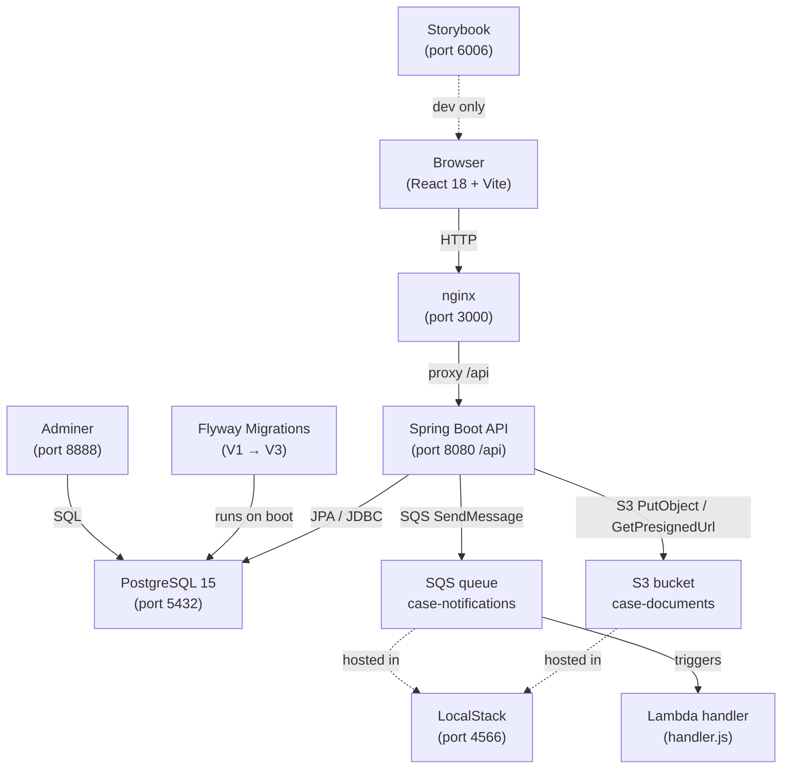

# New Hire Exploration Guide
### Bankruptcy Case Tracker

---

## 0. What Is This Project?

The Bankruptcy Case Tracker is a web application used by law firms to manage U.S. bankruptcy filings. Attorneys can create and search cases (Chapter 7, 11, or 13), attach court documents, and update case statuses. Trustees and admins have their own access levels. When a case status changes, the system fires an event to an AWS SQS queue, which triggers a Lambda function that logs the notification — simulating real-world async processing. Everything runs locally with Docker; no AWS account is required.

---

## 1. Quick Start (Everything Up in One Command)

```bash
# Clone and start the full stack
git clone https://github.com/<your-username>/bankruptcy-case-tracker.git
cd bankruptcy-case-tracker
docker compose up --build
```

First build takes ~3–5 minutes (downloads Maven + npm dependencies). Subsequent starts take ~30 seconds.

Once you see `Started BankruptcyTrackerApplication` in the logs, the stack is ready.

### Service Map

| Service | URL | What You Will See |
|---|---|---|
| **Frontend (React)** | http://localhost:3000 | Login page → case dashboard |
| **Backend API** | http://localhost:8080/api | JSON responses (use Swagger below) |
| **Swagger UI** | http://localhost:8080/api/swagger-ui.html | Interactive API explorer with Authorize button |
| **Adminer (DB Admin)** | http://localhost:8888 | PostgreSQL browser — cases, users, documents tables |
| **LocalStack (AWS sim)** | http://localhost:4566 | S3 + SQS emulator (use `awslocal` CLI to browse) |
| **Storybook (components)** | http://localhost:6006 | UI component explorer — run locally: `cd frontend && npm run storybook` |

### Stop / Reset

```bash
# Stop containers, keep data
docker compose down

# Stop and wipe all data (fresh start)
docker compose down -v
```

---

## 2. Explore the Frontend

### Open the app

Go to **http://localhost:3000** — you will see the login page.

### Demo credentials

| Role | Email | Password | What you can do |
|---|---|---|---|
| Admin | admin@strettodemo.com | demo1234 | Full access — create, update, delete, manage users |
| Attorney | attorney@strettodemo.com | demo1234 | Create and update cases, upload documents |
| Trustee | trustee@strettodemo.com | demo1234 | Read-only access |

### Pages to visit in order

1. **Login page** (`/login`) — Enter attorney credentials. Notice the loading state while the JWT is fetched, then the redirect to the cases list.
2. **Cases list** (`/cases`) — See paginated cases with status badges (OPEN=green, CLOSED=gray, DISMISSED=red, CONVERTED=yellow). Use the filter dropdowns to narrow by chapter or status.
3. **Case detail** (`/cases/:id`) — Click any case. See the full case metadata, documents panel, and status update control.
4. **Upload a document** — On any case detail page, upload a PDF. It goes to the LocalStack S3 bucket (`case-documents`).
5. **Change status** — Set a case to CLOSED. This fires an SQS message to `case-notifications`. Check the `api` container logs to see it dispatched.

### Frontend source layout

```
frontend/src/
  api/          → Axios API client modules (authApi, casesApi, documentsApi)
  context/      → AuthContext — JWT token + user state
  components/   → Layout (nav shell), ProtectedRoute
  pages/        → LoginPage, CasesPage, CaseDetailPage
  stories/      → Storybook stories for Layout, LoginPage, StatusBadge
  types/        → TypeScript interfaces (Case, User, Document, CaseStatus)
```

### Storybook (component explorer)

```bash
cd frontend
npm run storybook
# Opens at http://localhost:6006
```

Stories to look at first:
- **Components/Layout** — See the nav bar rendered for Attorney, Admin, and Trustee roles without running the full app.
- **Pages/LoginPage** — See Idle, Error (wrong credentials), and Loading states in isolation.
- **Components/StatusBadge** — See all four case status colour variants side by side.

---

## 3. Explore the Backend API

### Open Swagger UI

Go to **http://localhost:8080/api/swagger-ui.html**

### Authenticate first

1. Expand **POST /api/auth/login**
2. Click **Try it out**
3. Send:
   ```json
   { "email": "attorney@strettodemo.com", "password": "demo1234" }
   ```
4. Copy the `token` value from the response.
5. Click the **Authorize** button (top right, 🔒 icon).
6. Paste the token (no `Bearer` prefix — Swagger adds it automatically).
7. Click **Authorize** → **Close**.

You are now authenticated. All subsequent calls will include your JWT.

### Recommended endpoints to try in order

| # | Method | Endpoint | What to do |
|---|---|---|---|
| 1 | GET | `/api/cases` | Fetch the first page of cases — notice pagination envelope |
| 2 | GET | `/api/cases/summary` | See case counts by status — powers the dashboard summary bar |
| 3 | GET | `/api/cases/{id}` | Fetch a single case with full detail |
| 4 | POST | `/api/cases` | Create a new Chapter 7 case — note the 201 response with the new ID |
| 5 | PATCH | `/api/cases/{id}/status` | Change status to CLOSED — this fires the SQS event |
| 6 | POST | `/api/cases/{id}/documents` | Upload a file (multipart) — stored in LocalStack S3 |
| 7 | GET | `/api/cases/{id}/documents/{docId}/download-url` | Get a pre-signed S3 URL — paste it in the browser to download |

### Controller source locations

```
backend/src/main/java/com/strettodemo/
  auth/AuthController.java       → POST /auth/login, /auth/register
  cases/CaseController.java      → GET/POST/PUT/PATCH /cases
  documents/DocumentController.java → document upload + download-url
```

---

## 4. Explore the Database

### Open Adminer

Go to **http://localhost:8888**

Login with:
- **System**: PostgreSQL
- **Server**: postgres
- **Username**: postgres
- **Password**: postgres
- **Database**: casetracker

### Main tables

| Table | What it stores |
|---|---|
| `users` | Login accounts — email, hashed password, role (ADMIN/ATTORNEY/TRUSTEE) |
| `cases` | Bankruptcy filings — case number, debtor, chapter, status, assigned attorney |
| `documents` | File metadata — references the S3 key; the actual file lives in LocalStack S3 |

### Recommended queries to run

```sql
-- All users and their roles
SELECT id, email, role FROM users;

-- Open Chapter 7 cases with assigned attorney
SELECT c.case_number, c.debtor_name, c.status, u.full_name AS attorney
FROM cases c
LEFT JOIN users u ON u.id = c.assigned_to_id
WHERE c.status = 'OPEN' AND c.chapter = 7
ORDER BY c.filing_date DESC;

-- Documents uploaded per case
SELECT c.case_number, COUNT(d.id) AS doc_count
FROM cases c
LEFT JOIN documents d ON d.case_id = c.id
GROUP BY c.case_number;
```

### Schema and seed data

| File | Purpose |
|---|---|
| `backend/src/main/resources/db/migration/V1__initial_schema.sql` | Creates `users`, `cases`, `documents` tables + indexes |
| `backend/src/main/resources/db/migration/V2__seed_data.sql` | Inserts 3 demo users + sample cases |
| `backend/src/main/resources/db/migration/V3__fix_demo_passwords.sql` | Resets demo passwords to `demo1234` (bcrypt) |

Flyway runs these automatically on startup — you never need to run them manually.

---

## 5. Explore the CI/CD Pipeline

### Tool: GitHub Actions

Pipeline file: **`.github/workflows/ci.yml`**

Triggers on:
- Every push to `main` or `develop`
- Every pull request targeting `main`

### Pipeline stages

```
push / PR
  │
  ├── backend-test  (ubuntu-latest)
  │     Spins up postgres:15 service container
  │     → mvn verify  (compiles + runs JUnit tests)
  │
  ├── frontend-test  (ubuntu-latest)
  │     → npm ci
  │     → tsc --noEmit  (TypeScript type check)
  │     → npm run test  (Vitest)
  │
  └── docker-build  (main branch only, after both tests pass)
        → docker/build-push-action
        → Pushes bct-api:latest + bct-frontend:latest to DockerHub
        → Also tags with git SHA for traceability
```

### How to read a run

1. Go to your GitHub repo → **Actions** tab.
2. Click any workflow run to see all three jobs.
3. Expand a job to see each step's output and duration.
4. A red ✗ on `backend-test` or `frontend-test` blocks the Docker push.

### Required secrets (in repo Settings → Secrets)

| Secret | Used for |
|---|---|
| `DOCKERHUB_USERNAME` | DockerHub login for image push |
| `DOCKERHUB_TOKEN` | DockerHub access token (not your password) |

> These secrets are only needed for the `docker-build` job on the `main` branch. Tests run without any secrets.

---

## 6. Explore Cloud Services

**Local emulator used**: LocalStack 3.4 (simulates AWS S3 + SQS)

The project does **not** require a real AWS account. LocalStack runs as a Docker container and intercepts all AWS SDK calls.

### What runs in LocalStack

| AWS Service | Local resource | Used for |
|---|---|---|
| S3 | `case-documents` bucket | Stores uploaded court documents |
| SQS | `case-notifications` queue | Receives case status change events |

### How to browse LocalStack

```bash
# Install awslocal (wraps aws CLI to point at localhost:4566)
pip install awscli-local

# List S3 buckets
awslocal s3 ls

# List uploaded files
awslocal s3 ls s3://case-documents/

# List SQS messages (peek without consuming)
awslocal sqs receive-message \
  --queue-url http://localhost:4566/000000000000/case-notifications \
  --max-number-of-messages 5
```

### End-to-end cloud flow to try

1. Log in as attorney → open any case → change status to CLOSED.
2. Watch the `api` container logs: you will see `SQS message sent`.
3. Run the `awslocal sqs receive-message` command above — you should see the `CASE_STATUS_CHANGED` JSON payload.
4. The Lambda handler (`lambda/handler.js`) would process this message in a real AWS environment.

### LocalStack init script

`localstack-init/01-setup.sh` runs automatically when LocalStack starts — it creates the S3 bucket and SQS queue so the API finds them ready on first boot.

---

## 7. Run the Tests

| Test Type | Command | What It Tests | Where the Files Are |
|---|---|---|---|
| Backend unit | `cd backend && mvn test` | `CaseService` business logic with Mockito mocks | `backend/src/test/java/com/strettodemo/cases/CaseServiceTest.java` |
| Backend integration | `cd backend && mvn verify` | `CaseController` endpoints with a real test database | `backend/src/test/java/com/strettodemo/cases/CaseControllerTest.java` |
| Frontend unit | `cd frontend && npm run test` | `CasesPage` renders correctly, filters work, API is called | `frontend/src/test/CasesPage.test.tsx` |
| Component stories | `cd frontend && npm run storybook` | Visually verify Layout, LoginPage, StatusBadge in isolation | `frontend/src/stories/` |

### Test files worth reading first

1. **`CaseServiceTest.java`** — Shows how `CaseService.updateStatus()` fires an SQS message. Good example of mocking AWS SDK clients with Mockito.
2. **`CaseControllerTest.java`** — Shows how Spring Boot's `@SpringBootTest` + `TestRestTemplate` tests a full HTTP round-trip including JWT auth headers.
3. **`CasesPage.test.tsx`** — Shows how Vitest + React Testing Library mocks the `casesApi` module and asserts on rendered table rows.

---

## 8. Understand the Architecture



| Component | Role |
|---|---|
| **React + nginx** | SPA served as static files; nginx proxies `/api/*` calls to the Spring Boot container |
| **Spring Boot API** | REST endpoints, JWT auth, business logic, S3/SQS integration |
| **PostgreSQL + Flyway** | Relational store; schema versioned and auto-applied on startup |
| **LocalStack** | Local AWS simulator — S3 for file storage, SQS for async event delivery |
| **Lambda handler** | Node.js SQS consumer — processes `CASE_STATUS_CHANGED` notifications |
| **Adminer** | Browser-based DB admin — no pgAdmin install needed |
| **Storybook** | Isolated component development and visual regression reference |

---

## 9. Key Source Code Tour

| File / Directory | Why It Matters |
|---|---|
| `backend/src/main/java/com/strettodemo/auth/SecurityConfig.java` | The entire Spring Security configuration — JWT filter chain, CORS, which endpoints are public vs protected |
| `backend/src/main/java/com/strettodemo/auth/JwtService.java` | JWT generation and validation — understand token expiry (15 min access, 7 day refresh) |
| `backend/src/main/java/com/strettodemo/cases/CaseController.java` | Entry point for all case endpoints — see how pagination, filtering, and role checks are wired |
| `backend/src/main/java/com/strettodemo/cases/CaseService.java` | Core business logic — `updateStatus()` shows the SQS publish pattern |
| `backend/src/main/java/com/strettodemo/aws/SqsService.java` | AWS SDK v2 SQS client wrapper — how the API publishes events to LocalStack |
| `backend/src/main/java/com/strettodemo/common/OpenApiConfig.java` | Swagger UI customization — JWT `Authorize` button, API title and description |
| `backend/src/main/resources/db/migration/V1__initial_schema.sql` | The canonical data model — three tables, foreign keys, and performance indexes |
| `frontend/src/context/AuthContext.tsx` | Central auth state — token storage, `login()`, `logout()`, `useAuth()` hook |
| `frontend/src/api/` | All Axios API client modules — see how the JWT is attached to every request |
| `frontend/src/pages/CasesPage.tsx` | The most complex page — pagination, filtering, `STATUS_COLORS` badge map |
| `lambda/handler.js` | The SQS consumer — shows how Lambda processes `CASE_STATUS_CHANGED` events |
| `.github/workflows/ci.yml` | Full CI pipeline — backend tests, frontend tests, Docker build and push |

---

## 10. Things to Ask Your Team

1. **Where are production secrets stored?** `JWT_SECRET`, `DOCKERHUB_TOKEN`, and DB credentials are in GitHub Secrets for CI. Where do they live for the production deployment — AWS Secrets Manager, Vault, or somewhere else?
2. **What is the production deployment target?** The CI pipeline builds and pushes Docker images to DockerHub, but there is no `deploy` job in the pipeline. Where do those images actually run (ECS, EC2, Kubernetes, Fly.io)?
3. **Who runs database migrations in production?** Flyway runs automatically on app startup. Is that safe for production, or is there a manual gate before migrations are applied?
4. **Is the Lambda function deployed anywhere?** `lambda/handler.js` exists in the repo but is not wired into a real AWS Lambda. Is there a deployment script, SAM template, or CDK config elsewhere?
5. **What is the branching and release strategy?** The CI config shows `main` and `develop` branches. Are there environment-specific branches (staging, production)? What is the PR review requirement?
6. **Are there any known flaky tests?** The backend integration tests spin up a real Postgres container — are there timeout issues on slow CI runners?
7. **Who owns the LocalStack configuration?** The `localstack-init/01-setup.sh` script only creates S3 and SQS. If a new AWS service is added to the app, who is responsible for updating this init script?

---

## 11. Day-One Checklist

- [ ] Run `docker compose up --build` and confirm all 5 containers are healthy
- [ ] Log in to the frontend with attorney@strettodemo.com / demo1234
- [ ] Navigate through the cases list, open a case detail, upload a document
- [ ] Open Swagger UI at http://localhost:8080/api/swagger-ui.html, authenticate, and call `GET /api/cases`
- [ ] Try `PATCH /api/cases/{id}/status` in Swagger and watch the `api` container logs for the SQS message
- [ ] Log in to Adminer at http://localhost:8888 and run `SELECT * FROM cases LIMIT 10;`
- [ ] Run `cd frontend && npm run storybook` and browse the Layout, LoginPage, and StatusBadge stories
- [ ] Run the backend tests: `cd backend && mvn verify`
- [ ] Run the frontend tests: `cd frontend && npm run test`
- [ ] Read `.github/workflows/ci.yml` end-to-end to understand the pipeline stages
- [ ] Read `SecurityConfig.java`, `CaseService.java`, and `AuthContext.tsx` from Section 9
